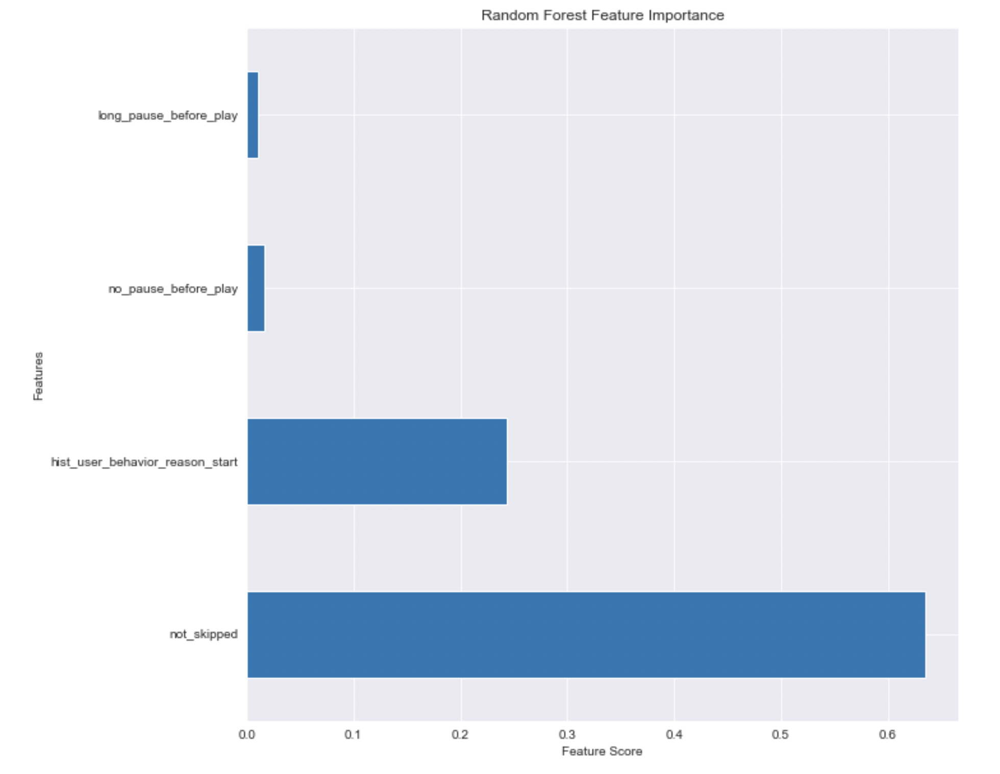

# Spotify Skip Prediction

Author: Kregg Jackson

## Project Overview

Spotify is an online music streaming service with over 190 million active users interacting with a library of over 40 million tracks. A key challenge for Spotify is to recommend the right music to each user. This project is designed for a music streaming company who wants to know whether or not a user will skip the next recommended song.

## The Data

The public version of the dataset originally consists of roughly 130 million listening sessions with associated user interactions on the Spotify service. I had to scale the dataset down to just one of the listening sessions that consisited of almost 2.9 million sessions documenting user interaction. The dataframe includes some key columns such as `no_pause_before_play`, `hist_user_behavior_reason_end`, and `not_skipped`.

## Methods

I built multiple classifier models after cleaning and evaluating the data. The cleaning process consisted of formatting the data so the classifers can read the data, analyzing class imbalance on the dependent variable, and dropping redundant columns. Next I built vizs to visually represent and better understand the predictors relationship with the dependendent variable. Then I built multiple classifier models and indentified the most important features from the best performing models. 

## Results

#### Random Forest

#### Gradient Boosting

## Conclusion

* Random forest was the best performing classifier and the most important features are `not_skipped`, `hist_user_behavior_start`, and `no_pause_before_play`.

* The classifier is saying the most important features deal with user behavior much more than the track features (like `key` or `release_year`). I recommend Spotify evaluate when a user is skipping a lot and either play songs already in the user's library or play something very different than the recently skipped tracks.

* According to the best performing classifiers the most important factor when predicting skip is `not_skipped`, 66% of songs played are skipped.

* The second most important feature is `hist_user_behavior_start` 47% of songs are begun by a user hitting the forward button and 33% of songs are started by the last song playing all the way through.

#### Next Steps

* Host the project online instead of Jupyter Notebook in order to be able to utilize the entire dataset

* Run a broader grid search on the random forest to see if there are more optimal hyperparameters

* Utilize a sklearn scaler like MinMaxScaler() to optimize the scale and distribution of the data

#### For More Information
See the full anaysis in the [Jupyter Notebook](https://github.com/kreggthegoat/skip-prediction/blob/main/README.md) or review the [presentation](https://github.com/kreggthegoat/skip-prediction/blob/main/pdfs/capstonepresentation.pdf).

## Thank You